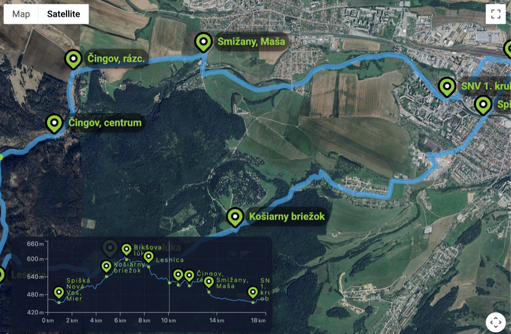

# react-route-profile

React component that renders a Google Map route with an interactive elevation profile.



## Installation

```bash
npm install react-route-profile
# or
yarn add react-route-profile
# or (preferred)
bun add react-route-profile
```

## Quick start

```tsx
import { RouteMap } from "react-route-profile";
import type { RouteConfig } from "react-route-profile";

const apiKey = process.env.VITE_GOOGLE_MAPS_API_KEY || "";

const myRoute: RouteConfig = {
  id: "01",
  name: "Sample route",
  center: { lat: 48.9, lng: 20.5 },
  zoomHorizontal: 14,
  zoomVertical: 12,
  geoJson: myGeoJsonObject,
  surface: [{ segment: [0, 1000], type: "asphalt" }],
  routes: [{ id: "A12", color: "green", segment: [0, 1000] }],
};

<RouteMap apiKey={apiKey} route={myRoute} height="100dvh" lang="en" />;
```

### Precompute elevation offline

```bash
bunx fetch-elevation --in path/to/route.geojson --out path/to/route.elevation.json --samples 200 --key $GOOGLE_MAPS_API_KEY
# - Elevation API must be enabled for this key
# - Omit --out to overwrite the input file with elevationProfile
# - Pass the output json to RouteConfig
```

## Customization

### Custom theme

```tsx
import type { Theme } from "react-route-profile";

const myTheme: Theme = {
  colors: {
    primary: "rgba(14, 165, 233, 1)",
    primaryMuted: "rgba(14, 165, 233, 0.7)",
    accent: "rgba(132, 204, 22, 1)",
    surface: "rgba(248, 250, 252, 1)",
  },
};

<RouteMap apiKey={apiKey} route={myRoute} theme={myTheme} lang="en" />;
```

### Sticky header sizing

```tsx
import { useMapHeader } from "react-route-profile";

const {
  refHeader,
  mapHeight,
} = useMapHeader();

<header ref={refHeader}>Header</header>
<div style={{ height: mapHeight }}>
  <RouteMap apiKey={apiKey} route={myRoute} height={mapHeight} lang="en" />
</div>;
```

## API

### RouteMap props

| Prop      | Type                   | Description                                            |
| --------- | ---------------------- | ------------------------------------------------------ |
| apiKey    | string                 | Required Google Maps JS API key.                       |
| route     | RouteConfig            | Route data (center, zooms, geoJson).                   |
| height    | number \| string       | Map height (e.g., `520` or `"100dvh"`).                |
| className | string                 | Optional wrapper class.                                |
| style     | CSSProperties          | Inline style overrides.                                |
| theme     | Theme                  | Optional theme override (colors, marker/dots, layout). |
| lang      | `"de" \| "en" \| "sk"` | Optional UI language for built-in labels.              |

### RouteConfig

| Field          | Type                                                              | Description                                  |
| -------------- | ----------------------------------------------------------------- | -------------------------------------------- |
| id             | string                                                            | Identifier for the route.                    |
| name           | string                                                            | Display name.                                |
| center         | `{ lat: number; lng: number }`                                    | Map center.                                  |
| zoomHorizontal | number (optional)                                                 | Zoom when landscape.                         |
| zoomVertical   | number (optional)                                                 | Zoom when portrait.                          |
| geoJson        | FeatureCollection                                                 | GeoJSON geometry and features.               |
| surface        | `Array<{ segment: [number, number]; type: SurfaceType }>`         | Optional surface segments for the strip.     |
| routes         | `Array<{ id: string; color: string; segment: [number, number] }>` | Optional route segments for the route strip. |

### Theme

| Field               | Type   | Description                             |
| ------------------- | ------ | --------------------------------------- |
| colors.primary      | string | Main accent color.                      |
| colors.primaryMuted | string | Softer variant of the primary.          |
| colors.accent       | string | Secondary/accent color for labels.      |
| colors.surface      | string | Background for loader/surfaces.         |
| marker              | object | Marker palette (outer/inner/start/end). |
| dots                | object | Hover/line dot colors.                  |
| map                 | object | Map stroke/marker sizing.               |
| chart               | object | Chart spacing/strokes/ticks.            |
| tooltip             | object | Tooltip background/text/padding.        |
| markerShape         | object | Marker icon/label sizing/offsets.       |

### useMapHeader

Returns helpers to size the map below a sticky header:

- `refHeader`: attach to your header element.
- `headerHeight`: measured header height (px), `0` until ready.
- `isHeaderReady`: `true` once the header is measured.
- `mapHeight`: string/number height you can pass to `RouteMap`.

## Notes

- Requires a valid Google Maps JavaScript API key with Maps JavaScript enabled.
- Provide `geoJson` as a FeatureCollection including your route geometry and optional point features for start/finish markers.

## Updating dependencies and publishing

1. Update dependencies from the repository root:

   ```bash
   bunx npm-check-updates -u
   bun install
   ```

   Review the dependency changes and resolve any installation, type, or build errors before continuing. The root `prepare` script runs the library build automatically during `bun install`.

   With the current tsup 8.5.1 setup, keep the root TypeScript dependency at `^5.9.3`. TypeScript 7.0.2 lacks the `ts.sys` API used by tsup's declaration builder and causes `Cannot read properties of undefined (reading 'useCaseSensitiveFileNames')`. If the update command upgrades TypeScript, restore `^5.9.3` in the root `package.json` and rerun `bun install`. Major React and Recharts upgrades can also require source and type changes.

2. Update dependencies in the example app and start the dev server:

   ```bash
   cd example
   bunx npm-check-updates -u
   bun install
   bun run dev
   ```

   Open the local URL printed by the dev server and manually check the map, elevation chart, tooltips, and hover interactions. Resolve any errors, then stop the server with `Ctrl+C` and return to the repository root:

   ```bash
   cd ..
   ```

   Keep the example's `react-route-profile` dependency set to `file:..` so it uses the local library. Review and commit both folders' `package.json` and `bun.lock` changes along with any necessary source fixes.

3. From the repository root, check types and build the library for publishing:

   ```bash
   bunx tsc --noEmit
   bun run build
   ```

   Use `bun run build`, which runs the package's tsup script. `bun build` invokes Bun's own bundler and fails without entrypoints. Confirm that the ESM, CJS, and declaration builds all succeed.

4. Set an unused release version in the root `package.json` before publishing. For example, increment the patch version without creating a Git commit or tag automatically:

   ```bash
   npm version patch --no-git-tag-version
   ```

   Skip this command if you have already set the intended release version.

5. Authenticate the npm CLI:

   ```bash
   npm login --registry=https://registry.npmjs.org/
   npm whoami
   ```

   Complete the browser authorization and any 2FA prompts. Being logged in to npmjs.com in your browser does not authenticate the terminal; Git username and email settings are unrelated. Verify that `npm whoami` prints `wimenxior371` or another account with publishing permission for this package.

6. Publish from the repository root:

   ```bash
   npm publish
   ```

   If publishing returns `E404`, check `npm whoami`. A `401 Unauthorized` response indicates that the CLI credentials are not accepted; run `npm login` again. If authentication succeeds, check that the account has publishing permission. A failed publish does not require another version bump unless that version already exists on npm.

## Publishing the example to GitHub Pages

The example uses the `gh-pages` package, installed in `example/devDependencies`, to publish `example/dist` to the `gh-pages` branch on `origin`. Run this from your source branch (normally `main`); **do not check out `gh-pages`**. The publisher uses a temporary clone to commit and push the built site, leaving your current branch selected. See the [gh-pages documentation](https://github.com/tschaub/gh-pages).

1. Start in the repository root on `main` with the source changes you want to deploy. Ensure dependencies are installed and the example has been checked manually with `bun run dev`, as described above.

2. Ensure `VITE_GOOGLE_MAPS_API_KEY` is configured in `example/.env.local` or your build environment. The example's Vite configuration already sets `base: '/react-route-profile/'` for the GitHub Pages project URL and aliases the library to `../src`, so it builds from local source without requiring an npm release first.

3. Build the static site and publish it:

   ```bash
   cd example
   bun run build
   bunx gh-pages -d dist -b gh-pages
   cd ..
   ```

   The command flags mean:

   - `-d dist`: publish the files from the example's `dist` directory.
   - `-b gh-pages`: publish to the destination Git branch named `gh-pages`. This does not switch your current branch or require you to check out `gh-pages`; stay on `main`. Since `gh-pages` is the default destination, `bunx gh-pages -d dist` is equivalent, but the full command makes the destination explicit.

   Run the publish command only after the build succeeds. This production build is needed for deployment; routine manual checks use `bun run dev`. The publisher replaces the previous site files on the remote `gh-pages` branch with the contents of `dist`.

4. In the GitHub repository's **Settings → Pages**, the publishing source should be **Deploy from a branch**, with branch **gh-pages** and folder **/ (root)**. After GitHub finishes deploying, check the [published example](https://webinoo.github.io/react-route-profile/), including the map and chart interactions.

Publishing uses Git authentication and push permission for `origin` (`git@github.com:webinoo/react-route-profile.git`), plus your Git `user.name` and `user.email` for the deployment commit. `npm login` is only needed for publishing the library to npm and does not authenticate GitHub Pages deployment.
